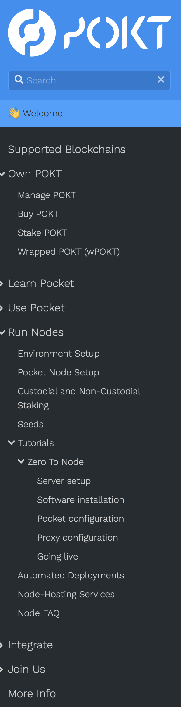

# Pocket Network Docs

## Quickstart

Install [hugo](https://gohugo.io/getting-started/installing/).

Once installed check to Make sure that the version you installed is `>=v0.93`.

```sh
hugo --version
```

For example `hugo v0.101.0+extended darwin/arm64 BuildDate=unknown` will work
because `v0.101 >= v0.93`

From there, clone the repo, making sure to pull in the submodules:

```sh
git clone --recursive https://github.com/pokt-foundation/docs.git
```

From there, navigate into the docs directory, and use start up
the local hugo server.

```sh
cd docs
hugo serve
```

This will start a live local server accessible at
[http://localhost:1313](http://localhost:1313). Anytime changes are detected in
any of the files used to build the site, the site will be re-built.

## Adding Content

### Adding Documentation Pages to Existing Sections

If you want to add content, simply create a new markdown file in the `content`
directory under the directory you want the content to live in.

Once created, each page needs a frontmatter as the beginning of the, which can
be either `yaml`, `toml`, or `json` specifying the following 3 things: `title`,
`menuTitle`, `weight`.

The following shows what the frontmatter is of the glossary page, with the following
being the first 5 lines of the file.

```yaml
---
title: Glossary
menuTitle: Glossary
weight: 10
---
```

The `title` represents what the page will be referred to as in the browser tab,
as well as in link tooltips, and possibly in external cards that are displayed
in tweets and in message previews.

The `menuTitle` represents what the page will be called in the navigation sidebar.

The `weight` determines the order in which pages in that same section level
will be ordered. Since the glossary page is in the "Learn" section, if we
wanted a page to come before this in the tree, we would need to give it a
weight smaller than 10, and if we wanted a page to come after this in the tree,
we would need to give it a weight larger than 10.

After the frontmatter lines, the rest of the content in the page can be created
in markdown, as well as a handful of "shortcodes" that can be used to embed
slightly more sophisticated elements easily.

### Adding New Documentation Page Sections

Sections are defined by directories with an `_index.md` file in them. The
entire site also has an `_index.md` file that serves as the home page. As
mentioned above, sections are ordered by their weights relative to other
pages in their section. Sections are ordered against each other by the
weight of their `_index.md`.

Let's look at how the "Own POKT", "Run Nodes", and "More Info" sections map
from what is in the content directory to the navigation bar.

```sh
├──  more-info
│   └──  _index.md
├──  node
│   ├──  tutorials
│   │   ├──  zero-to-node
│   │   │   ├──  _index.md
│   │   │   ├──  going-live.md
│   │   │   ├──  pocket-config.md
│   │   │   ├──  proxy-config.md
│   │   │   ├──  server-setup.md
│   │   │   └──  software-install.md
│   │   └──  _index.md
│   ├──  _index.md
│   ├──  automated-deployments.md
│   ├──  environment.md
│   ├──  faq.md
│   ├──  hosting-services.md
│   ├──  seeds.md
│   ├──  setup.md
│   └──  staking.md
├──  pokt
│   ├──  _index.md
│   ├──  buy.md
│   ├──  stake.md
│   ├──  wallets.md
│   └──  wpokt.md
```

And we can see how this maps to what the navigation bar displays.



Because of how things are ordered, we know that the weight of the following
`_index.md` files for the following sections must follow the given order
`more-info/_index.md > node/_index.md > pokt/_index.md`.

### Adding new API Docs

API Docs are a unique type of content that live in the `content/api-docs/`
directory. To create a new API Docs page, we'll need a URL that points to an
[OAS 3.0] or newer specification we intend on updating and regenerating when
changes occur, we can make use of the `static/oas/` directory. If not, we can
simply use the URL of where the document is hosted remotely.

The hard part of Adding a new API is building the specification, once that's
done, there's only 2 things we'll need to ask about the current specification.

1. Do we need to ignore the paths in the spec file?
2. Is there a path that all of the API endpoints use that's different from the server?

#### JSON RPC vs OAS

The first case would happen with any JSON-RPC API that sends all of its
requests to the same path. [OAS 3.0] different methods will happen on different
paths, so it doesn't 100% support describing these kinds of API. However, you
can force a JSON-RPC API into an [OAS 3.0] specification by using the method
names as the unique paths. Doing this will mean that any client/server codegen
from the specification will be wrong, but we're using these specifications to
enable interactive, in-browser documentation tooling, so this kind of breakage
will be acceptable for our case. It's through this process that we'll be able
to get the [Ethereum JSON-RPC
API](https://ethereum.org/en/developers/docs/apis/json-rpc/) into our
interactive documentation tooling.

#### A Different Shared Path

This second case only occurs if the first case also happens, but this would
occur if shared URL for the API Spec is different from the server URL. The
example of this that comes to mind is Avalanches C-Chain manages all EVM
compatibility through a `/ext/bc/C/` suffix to the URL. So the C-Chain
specification would hold for both of these cases.

#### Adding the New Page

Once the following have been determined, a new API Doc page can be created,
that can be defined entirely in the frontmatter. We'll use an example that
doesn't have the shared path issue, and one that does have a shared path,
and a non-server URL to show the example of adding both.

The following would be saved as `content/api-docs/pokt.md` to enable
the Pocket Mainnet API docs.

```yaml
---
type: api-doc
name: Pocket Mainnet
spec_url: /oas/pokt.json # Hosted in the /static directory.
portal_prefix: mainnet
---
```

The following would be saved as `content/api-docs/avalanche-c-chain.md` to
enable the Avalanche C-Chain API docs.

```yaml
---
type: api-doc
name: Avalanche C-Chain
spec_url: https://path-to-avax/spec.json
portal_prefix: avax-mainnet
ignore_api_path: true # Warning: explicitly setting to false still ignores path
api_slug: /ext/bc/C/
---
```

## Customizing Content

The first place to check for questions regarding customizing content should be
the [relearn theme
documentation](https://mcshelby.github.io/hugo-theme-relearn/), as its likely
the customization options accessible through the theme.

<!-- prettier-ignore-start -->

[OAS 3.0]: https://spec.openapis.org/oas/v3.0.3

<!-- prettier-ignore-end -->
