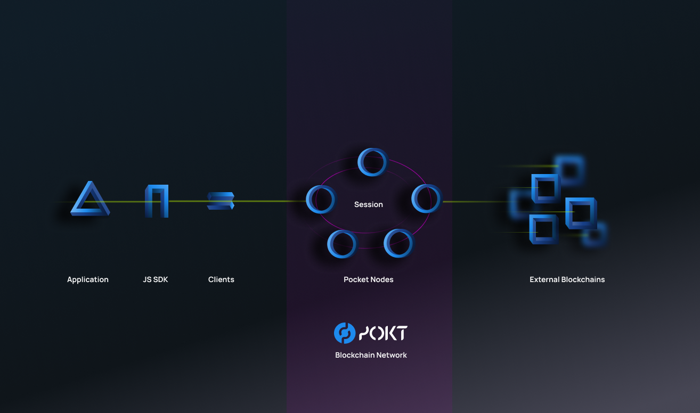

# 👋 Welcome

Pocket Network is a decentralized blockchain API built for Web3 apps, relaying data to and from any blockchain through a network of thousands of nodes. The Pocket Network protocol validates all relayed data and proportionally rewards the participating nodes with POKT.

These docs will provide you with all of the information you need to get started in the Pocket Network ecosystem.

## Looking to Dive In? Choose a Path



| 🛣Path | 🪄Magic | 🛠DIY |
| :--- | :--- | :--- |
| **🧑‍💻App** | [🔗Get an Endpoint](https://dashboard.pokt.network) | [🧩Use PocketJS](https://docs.pokt.network/js/guides/quickstart) |
| **🤖Node** | [🛩Node Pilot](https://decentralized-authority.gitbook.io/node-pilot/) | [🧱Quickstart Build](https://docs.pokt.network/core/guides/quickstart) |













## Just Here to Explore?

You might be interested in these areas:









## Want to Build With Us?

Follow these paths to help shape the future of Pocket Network:





## Steps to Find What You're Looking For

1. **Search the docs.** If it's a common question we probably already answer it here or in the other docs: [Pocket Core](https://docs.pokt.network/core), [PocketJS](https://docs.pokt.network/js).
2. **Search the** [**forum**](https://forum.pokt.network)**.** If it's not in the docs yet, there's a good chance someone already asked in the forum.
3. **Ask in the forum.** If no one else has asked, use the [Support Request category](https://forum.pokt.network/c/help/support-requests/54) to ask for help. We automatically forward all requests to Discord, so don't worry about people noticing it.
4. **Ask in** [**Discord**](https://discord.gg/uCZZkHTQjV)**.** Only once you've done the above steps should you ask your question in Discord.

