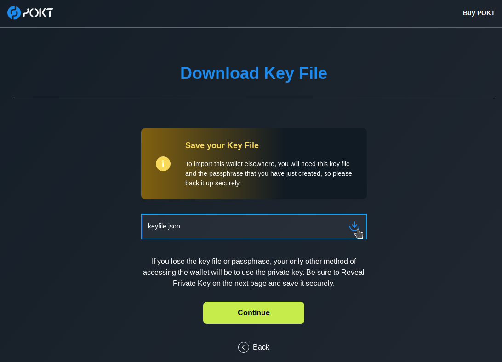

# 💰 Buy, Store & Stake POKT

## Prepare to Store POKT

Before buying any POKT, you should first ensure that you know how to store it safely.

### Create Wallet

You can use the [official wallet web app](https://wallet.pokt.network) to create your wallet. _Note: desktop and Ledger apps are in development. This documentation will be updated when they are available to use._

1. Click 'Create'.

2\. Enter a unique passphrase.


The passphrase unlocks/decrypts an encrypted version of the private key that is stored in a Key File. Make sure to store your passphrase safely, if you lose it you will not be able to unlock your Key File.


2\. Download the Key File by clicking the blue download icon and click Continue to open your account.

If you accidentally click Back, as long as you downloaded your Key File and saved your passphrase, you will now be able to import your new wallet.


Make sure to store your Key File safely, if you lose it you will only be able to use the Private Key method to import your wallet anywhere. The Key File is the more secure method of importing your wallet since it is encrypted by your passphrase.


3\. Click “Reveal Private Key” then enter your passphrase again to reveal the Private Key for your wallet.


Store your Private Key safely. This will be a second method for you to import your wallet in the event that you lose your Key File or passphrase. However, this is also less secure than the Key File since the Key File is encrypted by your passphrase.



Never reveal your Private Key to anyone. If someone has access to your Private Key, they have full access to all the funds. The only application that should ever need access to your Private Key is a wallet.


### Backup Wallet

It is important that you back up your Key File, passphrase, and private key securely. There are two considerations when choosing a backup method:

* **Theft Prevention**: make sure no-one else can access your Key File, passphrase, or private key
* **Loss Prevention**: make sure you don't lose access to your Key File, passphrase, or private key

The most secure way to prevent theft is to store your Key File, passphrase, and private key on a USB drive (or other secure external drive), disconnected from any online "cloud" service or internet-connected computer that can be hacked.


POKT will soon have Ledger support, which provides a little more advanced functionality than a USB drive, but there is no ETA on this.


For extra-secure theft prevention, you should split the Key File, passphrase and private key across separate drives and password-protect these drives so that anyone who gets their hands on a drive can't access the contents. For extra loss prevention, you should make multiple copies of these drives and store them in different locations, such as a personal safe, the safe of a trusted family member, and a bank safety deposit box.

Once you have created your backups, delete all traces of the Key File, passphrase and private key from the hard drive of the computer you used for account setup. To ensure deletion, consider using software such as sDelete (Windows) or shred followed by rm (Linux).


For more convenience, you may consider using a password manager that can store encrypted files. Just be mindful that you risk theft if your master password is compromised and you risk loss if you forget your master password.


### Import Wallet

The [official wallet web app](https://wallet.pokt.network) has two methods of importing your wallet. The Key File is the more secure method of importing your wallet since it is encrypted by your passphrase.

#### Key File Import

Click Select File then choose your `keyfile.json` from your local file explorer.

Enter your Key File passphrase, which you specified when creating the wallet.

Click Import.

#### Private Key Import

Enter your Private Key.

Create a temporary passphrase that will secure your session until you log out of the wallet. This is a measure to prevent anyone with access to your computer from stealing your funds.

## Buy POKT

### Exchanges

POKT is available to purchase on multiple global exchanges. Follow [this DAO proposal](https://forum.pokt.network/t/pep-4-pokt-listing/496) for updates on official listings.

Note that you can’t stake POKT from exchanges. To stake your POKT you would need to [withdraw to your wallet](buy-store-and-stake-pokt.md#transfer-pokt-to-your-wallet).

### Over-the-Counter (OTC)

Over-the-Counter (OTC) trading desks are white-label markets operated by trusted intermediaries who match buyers and sellers. They are typically used for large volume trades.

The POKT community has a number of OTC desks which can be found [here](https://forum.pokt.network/t/secondary-markets-for-pokt/629).

### Transfer POKT to Your Wallet

To receive POKT, you must use your Address, not your Public Key. The Public Key is used for API transactions, not basic wallet actions.

## Stake POKT

There is no many-to-one delegation in Pocket Network. You cannot simply stake POKT from your wallet and then forget about it. A POKT account must be staked on a node that is relaying RPC requests. However, if you do not have the skills to run a node yourself, you still have options.

### Run Your Own Node

Running your own node is an option if you possess both of the following:

* The DevOps skills to run your own node
* More than 15,000 POKT to meet the minimum node stake

Follow this guide to get started running your node:


[node-runner](paths/node-runner/)


### Pay Someone to Run Your Node

If you don't possess the skills to run your own node, but you do have more than 15,000 POKT for the minimum node stake, you can pay someone else to run your node(s). Payment models include a monthly subscription and a revenue share of your node's POKT earnings.

Until v0.8 of the protocol is released, your POKT will be entirely in the custody of the node runners, so be sure to do your due diligence. All third-party node runners can be found [here](https://forum.pokt.network/t/recommended-node-hosting-services/366).

### Join a Staking Pool

If you possess neither the skills nor more than the 15,000 POKT minimum node stake, you can join a staking pool. Like the third-party node runners above, staking pools are also entirely custodial, so be sure to do your due diligence. You can view the list of staking pools [here](https://forum.pokt.network/t/overview-of-pooling-services/2437).
