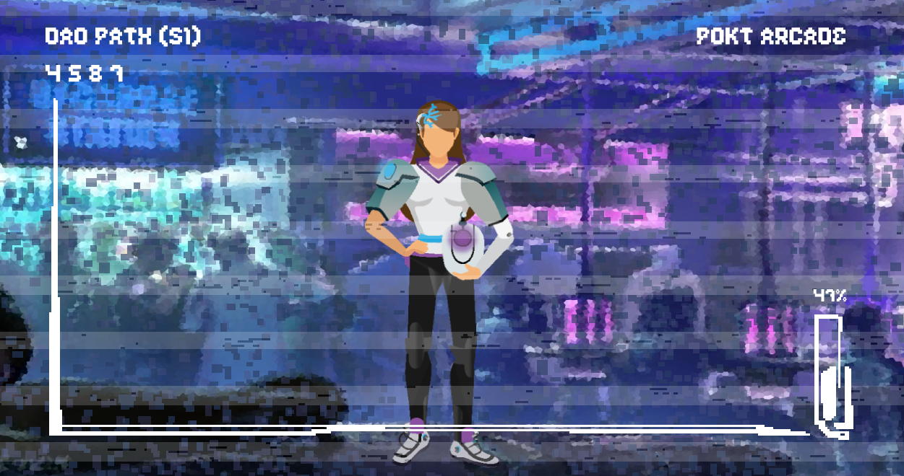

# 🏆 Governor/Contributors

## Biohacker

Greetings fledgling DAOist and aspiring Biohacker. It is now time to augment your skills via the cybernetic system, Pocket DAO, to truly enhance this community's mission. You will be considered a true Biohacker if you **acquire 2/3 of the following augments**, providing evidence in the [🏆trophies](https://discord.com/channels/553741558869131266/763504639299289138) channel, then submit the `!become-biohacker` command.

### Anode

Author any successful [proposal](../governance/proposals.md)

### Neurolink

Successfully claim a vote.

### Sentinel

Successfully challenge an action.


This quest can't be completed currently because our proposal challenge system isn't live yet.


## Cyborg

We're impressed with your augmentation capabilities, but to truly become a Cyborg you'll need to **acquire 3/5 of these augments**, providing evidence in the [🏆trophies](https://discord.com/channels/553741558869131266/763504639299289138) channel, then submit the `!become-cyborg` command.

### Cybernetic-Arm

Author a successful [PIP](../governance/proposals.md) (independent of the Anode quest).

### Cybernetic-Leg

Author a successful [PUP](../governance/proposals.md) (independent of the Anode quest).

### Implanted-Rebreather

Author a successful [PEP](../governance/proposals.md) (independent of the Anode quest).

### Feedback-Loop

Author a successful constitutional amendment.

### Regulated-Nervous-System

Join the Aragon Court.


This quest can't be completed currently because Aragon Court isn't live yet.


## Singularity


### Qualified!

You're now qualified for a vote in our DAO. Follow the rest of the steps outlined here to claim your vote:


So you have ventured where few still dare to go. Your current augments allow for deeply integrated communications with our cybernetic organization. **Acquire every augment from all ranks in the Governor path** then submit the `!become-singularity` command and you may just unlock infinite power... The Singularity is near...

### Nanobots

Author 3 successful [PEPs](../governance/proposals.md) (independent of previous quests).

### Machine-Learning

Author 3 successful [PUPs](../governance/proposals.md) (independent of previous quests).

### Artificial-Intelligence

Author 3 successful [PIPs](../governance/proposals.md) (independent of previous quests).

### Quantum-Resistance

Author 3 constitutional amendments (independent of previous quests) or successfully challenge 3 actions.


The latter option of this quest can't be done currently because our proposal challenge system isn't live yet.

