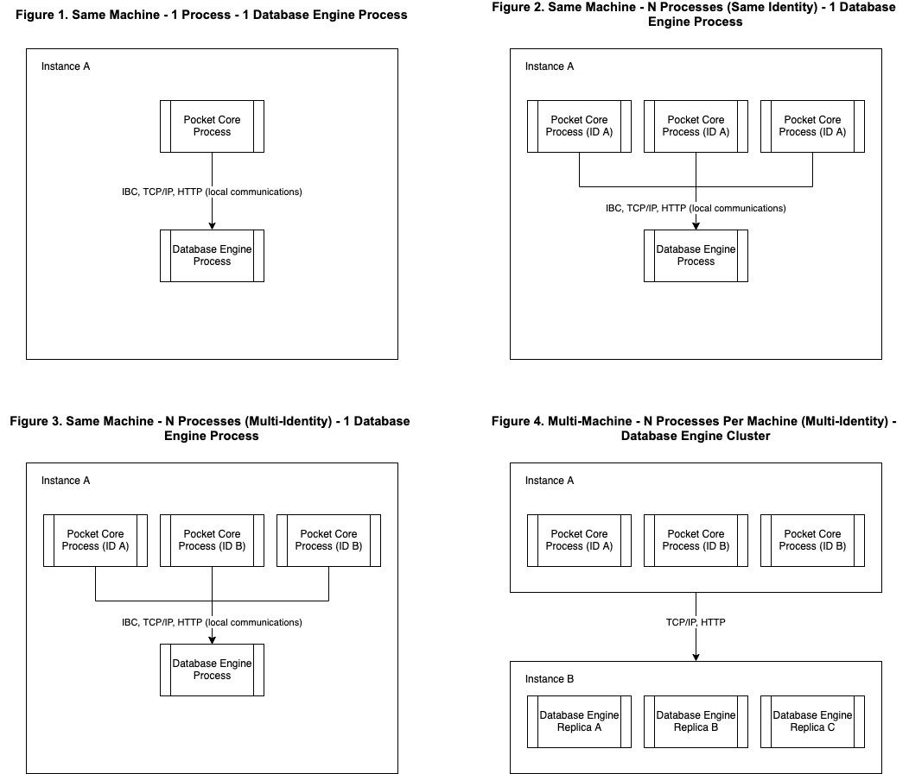

# 🗄 Persistence

The Persistence module is responsible for ensuring that the data continues to persist over time, across deployments, and throughout software changes. Currently, V0 handles data persistence through Tendermint. Tendermint uses a similar mechanism to most other blockchains, storing the different state data that needs to persist in Merkle trees. The roots of these trees are included in the block, and then for each block, each of the trees is stored as a file.

This design simplifies the computational overhead a new client would need to get up to sync with the current block, however, it does so at the cost of storage. While this decision was made to ensure that the barrier to entry of acting as a validator of a network is low, it fails to consider how critical full nodes, nodes that maintain copies of the data to be accessed and queried by applications, are as infrastructure for production applications.

As the core mission of Pocket Network is to provide access to high quality, decentralized infrastructure, the role of the full node needs to be considered as a priority and not an afterthought. Some of the changes that are being made to the persistence layer in V1 include:

* Moving from a Key Value Filesystem DB to an SQL based Tamper Proof Hybrid Mutable DB
* Decoupling the persistence layer to allow for a Client Server Architecture between pocket-core and persistence.

For those interacting with the network, these changes will mean significantly faster access to any state data that would have relied on a query to access.

For those running nodes, these changes will not only make the current experience better, but it will also open the door to more control and options when it comes to deployment configurations. These changes will:

* Drastically reduce the storage needs (80%) for storing the blockchain data.
* Drastically reduce the amount of resources needed to query state data. (10+ seconds -> milliseconds)
* Enable better data portability, making it easier to quickly spawn up additional databases as needed
* Enable individual scalability, making it easier to kill off and replace a failed process.
* Allow for an additional layer of fault tolerance, since the choice for database engine can be replaced.
* Enable for multi-process concurrency, making it possible to horizontally scale pocket-core without worrying about the storage cost for doing so.

## Underlying Database

### V0 – Key Value Filesystem

Currently, at each block, the data that represents the current state is stored as a tree in a file. While this provides some benefits, such as being able to simply move a directory to move the data, and easily being able to store arbitrary data, these benefits come with significant downsides. For one, regardless if anything has changed in the state between blocks, an entire copy of that tree is written again. There is no process for currently managing data deduplication.

The other issues come from using a filesystem as a production database. Out of the box, Linux cannot handle the amount of simultaneously open files needed to manage a system in this manner, hence needing to make sure the `ulimit` is properly specified before running a node. Using the filesystem also means that data access is almost entirely reliant on the I/O speeds of the system. When you add in how querying through old state would mean opening multiple files, this means that queries dependent on I/O are the slowest part of the system.

### V1 – Tamper Proof Hybrid Mutable DB

SQL provides a mature, optimized, battle-hardened solution to the data storage problem. One issue with SQL is it requires a well-defined data schema, and so it's well suited for arbitrary data storage. Since Pocket Network does not handle arbitrary computation, and instead serves a defined application specific purpose, SQL provides the opportunity for significant storage and speed optimizations.

A Persistence Client Middleware will communicate between `pocket-core` and a generic database engine, to define what needs to happen to define, persist, update, and query the datasets it stores. This mechanism will define the following to ensure consistency:

1. Versioning of the state dataset
2. Byte-perfect consistency of the data encoding
3. Schema definition mechanism
4. Deterministic write mechanism
5. Idempotent Dataset Updates

To ensure that the data is tamper proof, the Patricia Merkle Tree can be stored in the state dataset for each block, and can be used to verify the validity of each block. As the operations on the data are ACID and idempotent, any change to the underlying data is detectable.

## System Deployment

### V0 – Data Duplication

The current system requires that each pocket-core process needs access to an independent copy of the data to run. If a node needs to increase resources, whether that be to handle more traffic, or more data access, the only option is to start another process that needs a full copy of the data to run.

### V1 – Client-Server Architecture

Breaking the core and persistence layers into a client server architecture gives node runners the ability to scale and manage the respective processes more efficiently. While keeping the persistence layer on the same machine as the `pocket-core` process would allow for the least latency, it also restricts the node runner from configuring their infrastructure in a way that best serves the needed demand.

Some of the examples that node runners now have access to include:

* Spawning up multiple `pocket-core` processes on behalf of the same identity to scale to handle more demand.
* Connecting multiple `pocket-core` processes that represent at least two nodes in close physical proximity to the same database.
* Connecting multiple `pocket-core` process that represent multiple nodes to a database cluster to allow a collection of nodes to efficiently scale-up storage needs

Since nodes know the maximum amount of relays that the applications it's serving can request, this gives node runners the ability to save costs by allocating resources only as needed.

## More Details

Read more details about the [v1.0 Persistence module spec](https://docs.pokt.network/v1/persistence).
