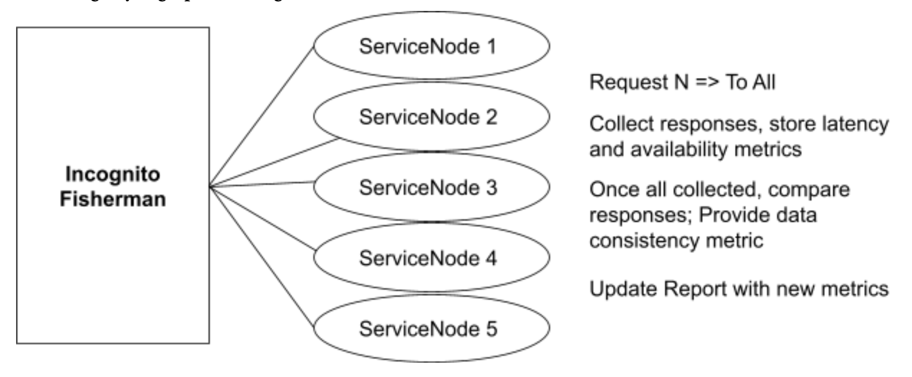
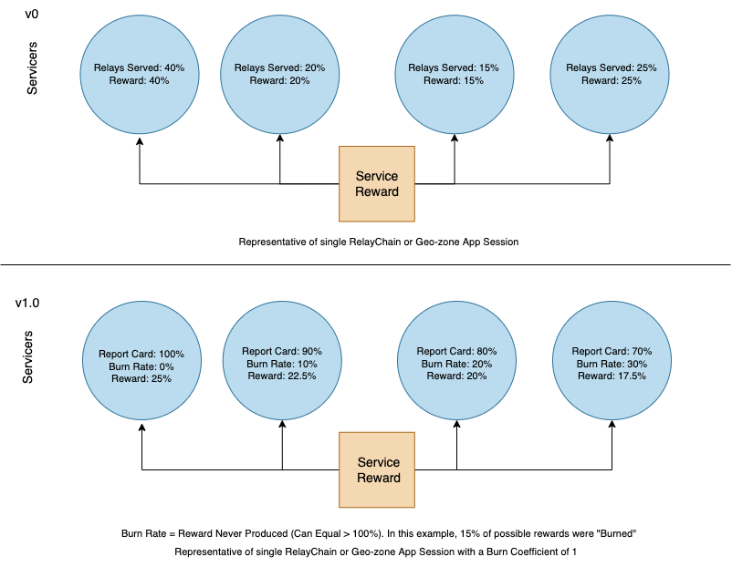
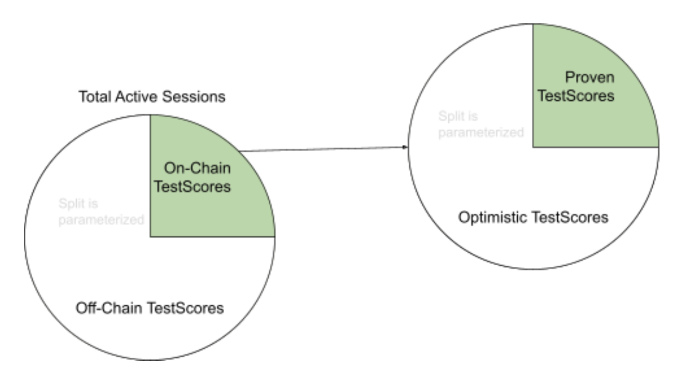

# 🪙 Utility

Pocket Network has always been designed to do one thing and do it well: provide a utilitarian economy that coordinates unstoppable Web3 access. In the context of the v1.0 Utility Module, this means we are laser-focused on optimizing the existing utility of the network, not expanding the scope of our utility.

This means optimizing how effectively we coordinate Web3 access, which can be broken down into two categories:

* **Relay Quality**: RPC node (Servicer) incentives should be as tightly-coupled as possible to relay quality, so that Pocket Network’s service not only matches centralized providers’ but provides a level of quality, unique to Pocket’s architecture, that can’t be matched
* **Relay Scalability:** our protocol should be as scalable as possible, to maximize the number of relays that the network can process and optimize the efficiency (and thus cost) of the service

## Relay Quality

### Quality Enforcement

#### v0 – Client-side + Layer-2 Enforcement

When we first designed Pocket Network, we assumed that service quality would be ensured through a Darwinian competitive dynamic. Indeed, there is a weak incentive to perform better on latency/volume to maximize relays processed, though this is insufficient to ensure quality on all metrics.

To address this, we included a simple client-side validation mechanism known as a challenge transaction, which enables Apps to protest the rewards that Servicers earned for low-quality work. However, 1.5 years into mainnet, challenge transactions have never been utilized, likely since the Portal does quality checks before it sends relays. We’ve learned that client-side validation is an insufficient model to rely upon because it 1) results in Apps experiencing quality failures before they are corrected, 2) forces Apps to choose between validating relays and maximizing relay speed.

The Portal is our gateway drug. It is a web application that stakes Pocket Apps on behalf of developers, and allows us to provide the simple RPC endpoints that apps have come to expect from centralized providers. Currently, the Portal administers the majority of the protocol’s App stakes to ensure service quality while we bootstrap new chains. In 2021 we developed various layer-2 [cherry-picking methods](https://forum.pokt.network/t/cherry-picker-improvements-dec-2021/1332) through the Portal to ensure that Apps receive service from the highest-quality Servicers available in each Session. These methods have laid the groundwork for the on-chain quality enforcement that we will be introducing in v1.0.

#### v1.0 – On-chain Enforcement

The Portal is a service that builds on the Pocket Network, managing app stakes on behalf of Apps and providing quality of service checks. Maintaining this core service has shown us how critical quality assurance is to our core utility, so we decided to take these lessons and move them on-chain.

We have considered a world in which other people deploy their own Portals and compete to provide the best layer-2 quality enforcement. However, we realized that Portals would fall to the tragedy of the commons; they are simultaneously expensive to run and inherently altruistic. The only way this could be resolved off-chain is through economies of scale and extractive pricing. Sound familiar? If we went down this route, we would no longer be solving the incentive problem we saw in the full node ecosystem, we’d simply be pushing it further up the stack.

To solve this in a manner compatible with our trustless vision, the protocol needs to directly incentivize actors on-chain to enforce quality according to a standardized ruleset. Enter the Fishermen. These are a new set of actors who can disguise themselves as Apps and sample the quality provided by Servicers.

Fishermen measure the quality of relays across three key metrics according to a standardized sampling protocol:

* **Availability:** Since Fishermen, Apps, and Servicers are all time-synced according to the session protocol, time-based sampling can be used to assess the availability of the Servicer. If no signed response can be collected from a Servicer, a null sample is recorded for the sample time slot. The more null samples the worse the Servicer’s availability score.
* **Latency:** The time it takes for the Fisherman to receive a signed response from the Servicer (i.e. Round Trip Time) is another metric that is tracked. Due to normal variances in latency to be expected from the varying geographical distance between Apps and Servicers, these metrics are used to disincentivize high-average latency rather than explicitly rewarding the highest-performing Servicers.
* **Consistency:** In addition to time-based sampling, it is mandatory for Fishermen to sample all Servicers in a session at once. The Fishermen can then compare responses and measure data consistency without needing their own comparative Web3 datasource.

Fishermen compile these samples into test scores for each Servicer, which are averaged out across Fishermen over time, ultimately determining the proportion of block rewards that Servicers receive. Fishermen are not incentivized to influence test scores because they are paid based on the quantity and completeness of their reports, not the content of the metrics being reported.

### Quality Incentives

#### v0 – Quantity-based

89% of v0 block rewards are distributed to Servicers proportional to the volume of relays they served. This means Pocket Network’s incentives currently optimize for the quantity of work done, not the quality of work done.

#### v1.0 – Quality-based

v1.0 prioritizes quality over quantity; block rewards are distributed to Servicers according to the aggregate test scores submitted by Fishermen.

The total salary for Servicers is still proportional to the volume of relays performed on aggregate. However, this is divided between Servicers in proportion to their test scores. Each Servicer above the MinimumReportCardThreshold is eligible for an equal salary from the total pool for their RelayChain or GeoZone but has their allocation burned by the difference between their ReportCard% and 100%.

<!---
Image was generated using the following link from diagrams.net: https://viewer.diagrams.net/?tags=%7B%7D&highlight=0000ff&edit=_blank&layers=1&nav=1&title=POKT%20V1.0%20Utility%20Rewards%20XML.drawio#R7VzbcuI4EP0aqnYfQlm%2B85iQbDK7sztTYasmeVSwAM8ayyOLAPn6kWwZXyTALGBzmYcQqyXL4pxWd6vbScfoTxePBEaTv7GHgo6ueYuOcd%2FRdccC7JMLlqnAsO1UMCa%2Bl4pALhj4H0gINSGd%2BR6KSwMpxgH1o7JwiMMQDWlJBgnB8%2FKwEQ7KT43gGEmCwRAGsvSb79FJKnUtLZc%2FIX88yZ4MNNEzhdlgIYgn0MPzgsh46Bh9gjFNr6aLPgo4dhku6X1%2FrOldLYygkNa54c%2BXUf%2B78dV9GL5akILl8nN4eyNmeYfBTHxhsVi6zBBAoXfLgWStEIdMeDeh04C1ALskeBZ6iD9BYy15SWJ%2B5JVQFgt8RHiKKFmyAfMc2wzaSQHWTEZQAKn%2FXuYGCorHq%2BlWT%2FiKfbYSXRPaqFvpHZkumlp5hhjPyBCJm4pQVuZxt01EIRkjKk3ELgrfOhclTO3Ami6x9q5JvFG0oGWyYkrwf6iPA0xyMkd%2BEFREMPDHIWsOGY2Iye%2FeEaE%2B2xO3omPqex5%2FzN184lM0iOCQP3PODICkEiMcUrGrgblJRfgz0GKjkoheQyuBn%2BlGQYVshQoZ2nptKfGzKxmGTAboXhEd1b1gO%2B3yYdYwaUHA%2FMc6xAoUwThKncrIX3AMJfyKdHV04w143kiTuGU9QHOMHjoM4gDo3TLott3NaCjADgwF7uBowGeevQg0s%2FsD0cSETvAYhzB4yKUV9czHfMY4EiR8R5QuBehwRnGZIrTw6Yu4nV%2B%2F8msGT9q6XxS67peKXQA2cZI6hE2W2Kjp4Pb0XMBxKpTrWrM%2Bx%2B61yS7YgV1GIlm%2B5AN58zWbgzfy25LW8bQipWTDQKt3aPWpu4NHofEB%2F%2Fr0ZfbvF%2Bg8xk9Pz9%2BiG%2BtcNvD%2FpViJ9uE4VoLaKqOtmuQmNm0bjOoNMbpxlZvimwNHNSPoOXCoimreTNvSDhXW9%2FIgJvNxQI7t3VXsU4xqcunhAZcDygEi7z4DV9ee0RwS73qCfVOT4hBDGXs2G%2FKrYn47oAKDEjf2jxnOOm7iBJ1bNgCAaJF3sqsx%2F%2F2MIoJiBle6sXUNj%2FhkfjgOUvYDuOxPoB%2FyLsI%2BGGI3H5xJXbuNIvY5QHHs4zABh2HDvjz7uZsRLuljNBr5Qx8lS0ymBtm6GQ7p0tOFnIGGbUwA1dcwKdC1TdkIOHqT6mXZ6ywAic%2BAGDPp5SqM%2BSw3vQMxVTHWpt7ywd9yftG0PV0GFD61WZp62wOYM0%2FQ2LpkxJiTtCXcm07QyHnjxIPFiZ8i7xxA7gu5wbUyR%2FRGcmeYxDrFISe%2FqTae43fIuOlSbAqAOuemKePT43Eqhz5KTvlSt3AqhlwLp7YJlJwqtmke9B6a0%2FUZg1M3kBLQCjrWhw62tJ%2BatpDrT%2FYXjbxpqVxT%2B7UDOauhNmPbXZN%2BXa5Jd%2Byu69YzY27XadQ3WfVIBdt9E7gu32Q61aB9TbBhHI1RpX10L94%2BAlApZ7vycalhp9Rq4W3%2FsuquuXl1SGSoWdu3rOqW95kF8g11%2BLqq%2BpvJr4pcWInm6GpRpwhn7ak%2F%2BwX0oE2OT7ewuienbqucKlzfZe3bVjjttcrpCddW94pqFLVVS89dXUPlVTXmF1Ze3e90DirxSIMvt27wmxcd8duVAgmL%2BLsaaDvoB3LNUXVCjpgPYaP6%2BUFZU2dIRMn5GVKUDqyRSDm7M%2Fd%2BJ79qPdNQ6wFodP%2FJNc1aauDU1AJjuxqAJGF4RYpgm9XXq1WlbaA1WhK4%2FMyLbufpydMyxWdRsN4v7rAlH9g26tkbPrtavl5NywdqOED9yiyfzvZbVonZaPry00Qj1m%2BVQN9RF9yaunCRVaX9DIJzej4wM7un%2FJbn%2Bb%2B8uZfaVNLphia7kaO9uqnWGVVG5xA6U7Qh7Bvx%2B1fZCu0fxFBkv78S7M2GiIt%2B60M%2B%2FuHHDPJFs2nglFMiFESc237vsstPfCCd%2BLxMihZsGNfCfmdVBE3VM8JM5d4SBSXJc%2FnwOSIonV0sly%2BTP7%2Bw%2FF8aWtBQWz%2BehrJm%2Ftf9abko%2FxcJxsNP
-->

These incentives enable Pocket Network to probabilistically guarantee a Service Level Agreement for applications.

## Relay Scalability

### Proving Relays

#### v0 – Pessimistic Proofs of Relays

v0 is pessimistic about proving work done; guilty until proven innocent. To validate the volume of relays they completed, Servicers must generate plasma merkle trees, store relay evidence, and create merkle proofs, which will then be validated by Validators, as part of a multi-step Zero Knowledge Range Proof.

This works very well as secure cryptography but it scales linearly because plasma merkle trees have O(**n** log(**n**)) space complexity, where **n** is the number of relays, and the branch must be included in every proof transaction. In practice, this means proofs get more expensive to process in proportion to relays, which contributes to higher CPU loads and longer block processing times.

If Pocket Network is to grow to serve quadrillions of relays, the relay proof lifecycle must be fundamentally restructured.

#### v1.0 – Optimistic Proofs of Samples

Work payments in v1.0 are optimistic, more like a salary compared to v0’s unit-based payments.

The total salary pool is still proportional to the volume of relays performed on aggregate. To determine the size of this total available reward, Fishermen probabilistically estimate volume using probabilistic hash collisions rather than counting up (and proving) every relay.

The Fishermen samples themselves are also optimistic. Fishermen only need to submit test scores on a pseudorandom schedule and only need to verify a single pseudorandomly selected non-null sample. Since the Fishermen (and Servicers) can’t predict which test scores will be submitted or which samples will need to be verified, the monitoring system remains a secure deterrent of bad behavior while avoiding the cost that would come from validating every test score.

By switching to an optimistic model, we reduce both the frequency and size of proofs, which should allow relays to scale exponentially rather than linearly.

### Creating & Validating Proofs

#### v0 – Unified Actors

In v0, until recently, Validators and Servicers were bundled together. This meant that the scalability of Servicers was bound by Validators, for two reasons:

* Validators are subject to the scalability of the BFT consensus algorithm, which is arguably the least scalable component of our protocol by design
* Servicers are burdened with performing expensive Validator tasks, even though these aren’t necessary to perform Servicer tasks

We have already begun moving away from this model with the separation of Validators and Servicers in v0.7. Limiting Validators to the top 1,000 by stake has allowed our Servicer count to grow to almost 25,000 without impacting the health of our blockchain. v1.0 will take this a step further.

#### v1.0 – Task-based Specialization of Actors

We have already agreed that Servicers shouldn’t need to validate proofs. Taking this a step further, why should they need to prove their own work? In v0, Servicers must constantly store claims and proofs if they want to get paid, which presents a computational burden that distracts them from optimizing on their most important tasks: relaying RPC requests.

In v1.0, we are more explicitly separating actors according to their tasks. We are introducing the Fisherman, whose sole responsibility is to prove the quality of work done. This narrows the scope of Servicer work to just performing relays, which should make it cheaper to perform relays and thus dramatically enhance the efficiency of the network’s core task.

## v1.0 Utility Roadmap

### 1. Proto-Fish

We will begin live-testing the Fisherman sampling methods in v0, using the Portal as a low-risk supervised environment.

### 2. Castaway

When v1.0 launches, we will begin with a single DAO-governed Fisherman. This will enable us to adopt all the benefits of v1.0, with the Fisherman actor being the only trusted actor in the network.

### 3. Fishermen

We will then transition to a multi-Fisherman model, wherein DAO governance can appoint and remove Fishermen, burning them to penalize bad behavior.

### 4. Cast-Net

Finally, Fishermen will become truly trustless actors as the monitoring/enforcement of their behavior is moved entirely on-chain.

## More Details

Read more details about the [v1.0 Utility module spec](https://docs.pokt.network/v1/utility).
