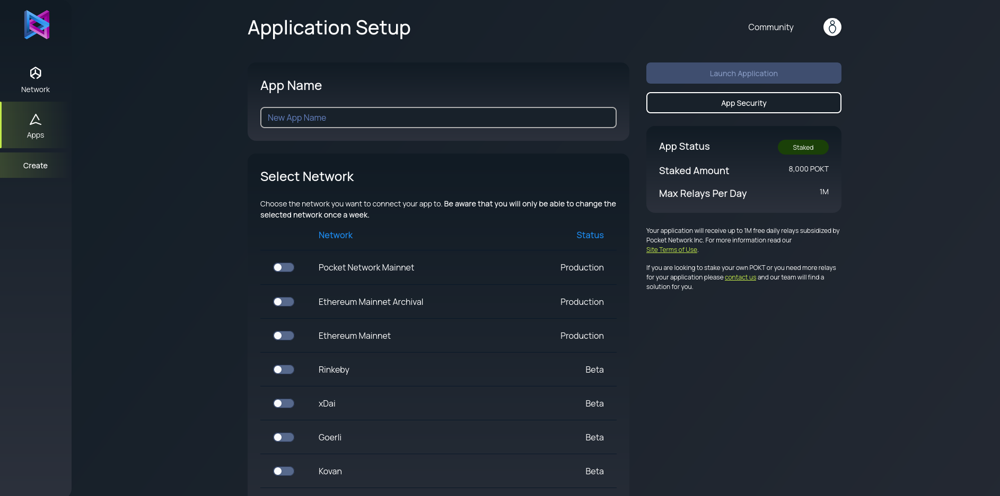
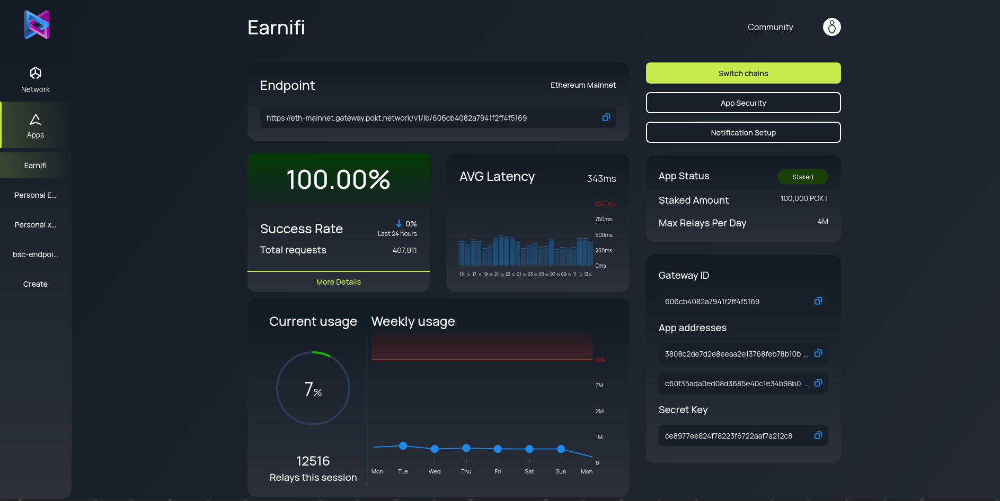

# 🧑‍💻 App Developer

## Pocket Portal

While a direct integration with [PocketJS](https://docs.pokt.network/js) is the best way to optimize for reliability and censorship-resistance, we understand the need to build an MVP. Most teams need to move fast and build prototypes quickly—and making sure these integrations are failsafe can take some time. Sometimes you just need an endpoint to query data or send transactions. This is what the Pocket Portal provides, an abstraction layer that integrates with PocketJS on your behalf and [generates the endpoint you need](https://www.portal.pokt.network/).

The Portal lets you create an endpoint for the chain you want in just a few clicks and provides you with the features you've come to expect in centralized API services, such as usage/uptime metrics and notifications/alerts.

## Setup Guide

Go to the [Pocket Portal](https://portal.pokt.network), sign up and verify your email.


Once you've done so, log in and you'll be greeted by the Network Overview section.



In this section, you'll see all the important parts of the network: how many relays are being served daily, the overall success rate of the network, and the number of apps, nodes, and POKT staked. A summary of chains being served by the network is also available.


Head over to the "My Apps" section and create your app.




In this section, you'll be able to select one of the available chains that are currently available. More will be made available depending on demand.


Once you've hit "Launch Application", all is done and you can start using your endpoint! You should be greeted by the main application screen, which will show all the metrics, which as soon as you start submitting requests, should start appearing.



The view you see is the main view for your application. Here, you'll see key details:

* On the top left, you'll see and will be able to copy your endpoint URL.
* On the right, first you'll see key information about your Pocket application:
  * The **app status**, which indicates if the app is currently staked or unstaked. The app must be staked in order to be eligible for service.
  * The **amount of POKT** staked, which will be enough to add up to the free tier.
  * The **max amount of relays you can send per day,** which currently is 1M as per the free tier.
* On the bottom right, you'll see important identifying information:
  * The **Gateway ID,** used by the Dashboard to fetch your app's information. It's part of your endpoint URL as well.
  * The **App's public key**, which will let you inspect your application on-chain.
  * The **Secret Key**, which is a security feature you can use to make your Pocket Dashboard endpoint more secure.
* On the left side, you'll see all the metrics available for your app.

## Setting Up Notifications

Turning on notifications is a great way to stay up to date with your app. We respect our users' privacy, and therefore we only send important emails, such as usage notifications. To activate them:

* Click on the "Notifications" button on your app's dashboard, and you'll see the notifications screen.
* Turn on any notifications you're interested in receiving, and then click "Save changes" when you're done.


## Securing your Application

For securing your endpoint, you can go to the "App Security" section of the Portal. This section of the app contains all the security settings you'll have at your disposal for security. We provide whitelisting for both origins and user agents and also let you enable and disable secret key usage.

### Whitelisting User Agents

Mainly useful for mobile apps, whitelisting user agents lets you limit requests to only the ones you've put in the whitelist. An example user agent would be `com.example.bobapp`. This would let Bob's mobile app use the endpoint as his user agent would be whitelisted. If Alice, with user agent `com.example.aliceapp` tried to use the endpoint, she wouldn't be able to, as her requests would be blocked before they're sent to the network.

### Whitelisting Origins

To whitelist origins, just write the URL of the domain you want to allow. All requests from other domains will be blocked. This is a very effective way to only use your app in production, staging, or test environments and to stop malicious users from stealing your endpoint and using it in their project.

For origins, we support wildcard domains as well as normal domains. An example URL would be `https://portal.pokt.network`.

### Using your Secret Key

Every application has a secret key associated with it, which can be enabled so that every request has to send it using [HTTP Basic Authentication](https://developer.mozilla.org/en-US/docs/Web/HTTP/Authentication) to be accepted. An example cURL request with the secret key enabled would be:

```text
curl --user :YOUR-SECRET-KEY \\
  https://<network>.gateway.pokt.network/v1/YOUR-GATEWAY-ID
```

This is a truncated example of a call that does not actually send a request. See below for a more detailed example.

## Testing your Endpoint

Once you've set up your endpoint as per your liking, you can test it however you'd like. In the main application view of the dashboard, you'll be able to see and copy your endpoint to the clipboard. The way endpoints are used in terms of content sent in the body will depend on the chain.

For EVM-based chains \(Ethereum, BSC, and others\), which see the majority of traffic in Pocket Network, you can refer to the official [JSON-RPC](https://ethereum.org/en/developers/docs/apis/json-rpc/#json-rpc-methods) specification. Below we have a few examples of requests for Pocket compatible chains.

### Ethereum, BSC and EVM-based chains

```text
curl -X POST \\
-H "Content-Type: application/json" \\
--data '{"jsonrpc": "2.0", "id": 1, "method": "eth_blockNumber", "params": []}' \\
"https://<NETWORK>.gateway.pokt.network/v1/<YOUR-GATEWAY-ID>"
```

### How Endpoints are Constructed

All endpoints have a similar structure, as they all have:

* The network prefix; see the RelayChainIDs [here](../../resources/references/supported-blockchains.md)
* The main URL \(`gateway.pokt.network/v1/`\)
* If it's a load-balanced endpoint, it will also have the LB prefix \(`/lb/`\)
* The Gateway ID.

## Switching Chains

If you ever need to switch chains for your endpoint, you have the ability to do so once a week. Click on the "Switch chains" button to do so.

## Play the Arcade, Join the DAO

You can earn a vote in the DAO and help shape the future of Pocket Network, including deciding which ecosystem tooling our treasury supports and how we configure important on-chain parameters such as the cost of a relay.

Once you've sent 1k relays through the Portal, join our [Discord](https://discord.gg/uCZZkHTQjV) and report this in the [🏆achievement-unlocked](https://discord.com/channels/553741558869131266/763504639299289138) channel.

Next, you'll need to unlock 5 of the following 👾POKT Arcade achievements to qualify for your vote:

1. `partition`: show an integration that uses at least 3 different application stakes
2. `maintenance`: build your own tooling or have an approved PR on existing pocket-related open source application tooling 
3. `loadtest`: participate in load testing nodes with at least 1m relays in pocket testnets 
4. `qa`: create or contribute \(non-grammatical\) improvements to pocket application technical documentation or open source application tooling documentation
5. `bootcamp_dev`: create or contribute \(non-grammatical\) improvements to a guide on how to use pocket for application developers 
6. `mentor`: help another 🧑‍💻Developer set up their app
7. `torrent1`: send 2.5m relays
8. `torrent2`: send 5m relays
9. `torrent3`: send 7.5m relays
10. `torrent4`: send 10m relays

For more details on how to join the DAO, go here:




