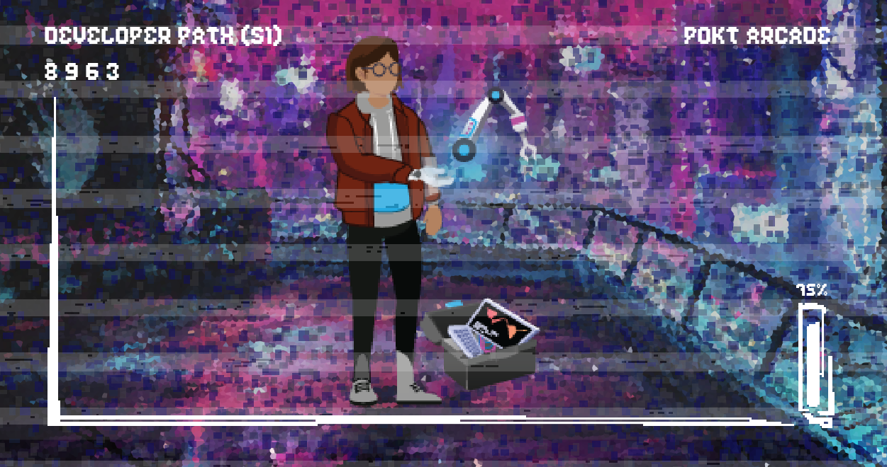

# 👾 App Developer Path

## Netizen


So you want to be a full-fledged Cyberpunk? Joining our elite is not for the faint of heart. You must first prove your worth as a Netizen by **completing 1/3 of the following bounties**, providing evidence in the [🏆achievement-unlocked](https://discord.com/channels/553741558869131266/763504639299289138) channel. To claim your new Netizen role once you've done this, type `!become-netizen`

### **Gateway**

Get a Pocket Portal endpoint and send 1k relays_._


To verify the number of relays sent by you through the Portal, you need to send an email to jack at pokt dot network, using the email you used to sign up for the Portal, with the subject as "Gateway Quest" and your `applicationPublicKey` in the body.


### **Sync** 

Stake your application successfully in the Pocket mainnet.


To verify that you own the account, you must sign a message using the following CLI command, removing the `<>` and keeping the `""`

```text
pocket accounts sign <account address> "account address"
```

Then send your address, public key, and the signature that was generated by the command to the 🏆achievement\_unlocked channel.


### **Web3**

Integrate your application using pocket-js. 


To verify this, share the GitHub repo with your pocket-js integration.


## Savant


So you aren’t a poser, now let’s see if you're worthy to join the ranks of the Savants. To earn this title, you must **complete 5/10 of the following bounties**, providing evidence in the [🏆achievement-unlocked](https://discord.com/channels/553741558869131266/763504639299289138) channel. To claim your new Savant role once you've done this, type `!become-savant`

### Partition

Complete a pocket-js integration that uses at least 3 different application stakes. To verify this, share the GitHub repo with your pocket-js integration.

### Maintenance

Build your own tooling or have an approved PR on existing Pocket-related open-source application tooling.

### Loadtest

Participate in load testing nodes with at least 1m relays in Pocket testnets.

### QA

Create or contribute \(non-grammatical\) improvements to Pocket application technical documentation or open-source application tooling documentation.

### Bootcamp\_Dev

Create or contribute \(non-grammatical\) improvements to a guide on how to use Pocket for other app developers.

### Mentor

Help another app developer get started using Pocket.

### Torrent

This bounty is split into 4 parts, each worth 1 point towards your 5/10 target:

1. Send 2.5m relays through Pocket Network
2. Send 5m relays
3. Send 7.5m relays
4. Send 10m relays

## Cyberpunk


### Qualified!

You're now qualified for a vote in our DAO. Follow the rest of the steps outlined here to claim your vote:






Well done Savant, we recognize the trials you have taken on and the skills you have acquired to reach this point. The bounties at this point are the ones that will build lasting resilience and autonomy for the future we seek to create. **Complete all bounties from every rank of the App Developer path** then submit the `!become-cyberpunk` command to enter the elite of the elite, the pantheon of Cyberpunks.

### Token\_Handler

Build tooling for AAT management and have 3 \(BrightID\) Verified Savants or Pocket core team members vouch for the tool's quality.

### Optimizer

Build tooling for optimizing app stake prices and have 3 \(BrightID\) Verified Savants or Pocket core team members vouch for the tool's quality.

### Founded

Create or take ownership of an application, SDK, or tool that is vouched for by at least 3 \(BrightID\) Verified Savants or Pocket core team members.

### Ventured

Submit an application-oriented PEP and receive a POKT grant from the DAO.

