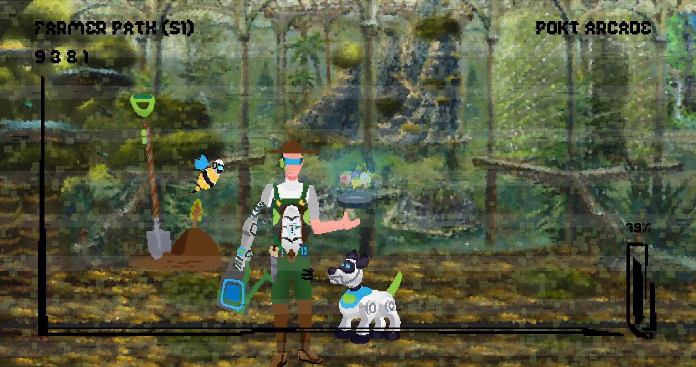

# 👾 Community Shepherd Path

## Farmer

Namaste aspiring Shepherd, we kindly thank you for your willingness to nurture this community into one that is regenerative and ripe with autonomous agents. While our allies in the Node Runner and App Developer paths are fortifying our outposts and advancing our objectives, the jobs on this ranch serve to replenish our ecosystem. To join the rank of Farmers, **complete 6/8 of the following jobs**,  providing evidence in the [🏆trophies](https://discord.com/channels/553741558869131266/763504639299289138) channel, then submit the `!become-farmer` command.

### Seed\_Pouch

Swap the RPC endpoints on your wallets with Pocket. 

See the MetaMask page below for a walkthrough of how to do this:




To verify that you used the app, screen record yourself submitting an on-chain action \(e.g. submitting a transaction or querying chain data\), with your Discord username somewhere on the screen, then share the screen recording to [🏆trophies](https://discord.com/channels/553741558869131266/763504639299289138) when you report the quest completion.


### Quick\_Repair

Highlight \(and fix where possible\) inconsistencies/bugs or other improvements in Pocket's website, documentation, social channels or content.

### Bird\_Seed

Tweet about Pocket in a meaningful way, retweeted by 3 \(BrightID\) Verified Shepherd's or Pocket core team members.

### Swarm

Identify and share 3 relevant \(unshared\) tweets that other Farmhands can respond to.

### Dogfood

Confirm that you have used at least 2 of the apps listed here:




To verify that you used the app, screen record yourself submitting an on-chain action \(e.g. submitting a transaction or querying chain data\), with your Discord username somewhere on the screen, then share the screen recording to [🏆trophies](https://discord.com/channels/553741558869131266/763504639299289138) when you report the quest completion.


### Seedling

Generate 1 unique idea for future iterations of Pocket Arcade.

### Leaflet

Create a Pocket meme and get at least 5 dab reacts from \(BrightID\) Verified Shepherd's or Pocket core team members.

### Fertilizer

Purchase Discord Nitro and boost Pocket Network's community server.

## Shepherd

At this point you have now familiarized yourself with the ways of the Farmers. Your studies at this level will seek to align you more deeply with the vision and mission that has brought us together. **Completing 4/6 of the following jobs** will earn you a flight to the Shepherd's station. Provide proof of your work in the [🏆trophies](https://discord.com/channels/553741558869131266/763504639299289138) channel, then submit the `!become-shepherd` command.

### Infolink

Attend a Pocket workshop or community call.

### Biomimicry

Make notes/takeaways from a Pocket workshop or community call.

### Nanobee

Help to organize a Pocket workshop or community call.

### Foraging

Collect and organize user feedback/questions for the Pocket core team.

### Cultivation

Mentor anyone into achieving the Farmer rank.

### Path\_of\_Least\_Resistance

Create educational content for Pocket.

## Regen


### Qualified!

You're now qualified for a vote in our DAO. Follow the rest of the steps outlined here to claim your vote:




“De lo mio”, Shepherd. In our homeland, this term of endearment means “one of mine”. Because you have made it here, we consider you to be one of our closest allies in a mission yet unfulfilled. But there is little time for frivolities, the enemy has expanded into the farthest reaches of Web3 and we must continue to cultivate the lands upon which our node and dev allies will fight them. The work of Shepherds requires the softest of touches, as you will be venturing out to guide others towards the regenerative path of true decentralization. **Complete every job in all ranks of the Community Shepherd path** then submit the `!become-regen` command to earn enlightenment in the pantheon of Regens.

### Telepathy

Create meaningful content about Pocket Network, vouched for by 3 \(BrightID\) Verified Shepherd's or Pocket core team members.

### Topographics

Translate content on Pocket's website, blog or docs.

### Wool\_Clipper

Successfully onboard an app developer into Pocket Network.

### Shepherds\_Crook

Successfully onboard a node runner into Pocket Network.

### Sheep\_Dog

Successfully onboard 5 node runners into Pocket Network.

### Seed\_Fund

Submit a community-orientated [PEP](../submit-a-proposal/pep-pocket-ecosystem-proposal.md) and receive a POKT grant from the DAO.

### Assurance

QA and document a Pocket library, product or pre-release.

