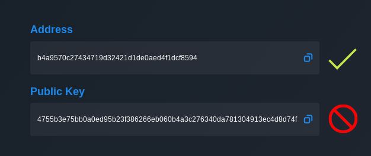

# Buy POKT

## Exchanges

POKT is available to purchase on multiple global exchanges. Follow [this DAO proposal](https://forum.pokt.network/t/pep-4-pokt-listing/496) for updates on official listings.

Note that you can’t stake POKT from exchanges. To stake your POKT you would need to withdraw to your wallet (see below).

## Over-the-Counter (OTC)

Over-the-Counter (OTC) trading desks are white-label markets operated by trusted intermediaries who match buyers and sellers. They are typically used for large volume trades.

The POKT community has a number of OTC desks which can be found [here](https://forum.pokt.network/t/secondary-markets-for-pokt/629).

## Transfer POKT to Your Wallet

To receive POKT, you must use your Address, not your Public Key. The Public Key is used for API transactions, not basic wallet actions.

