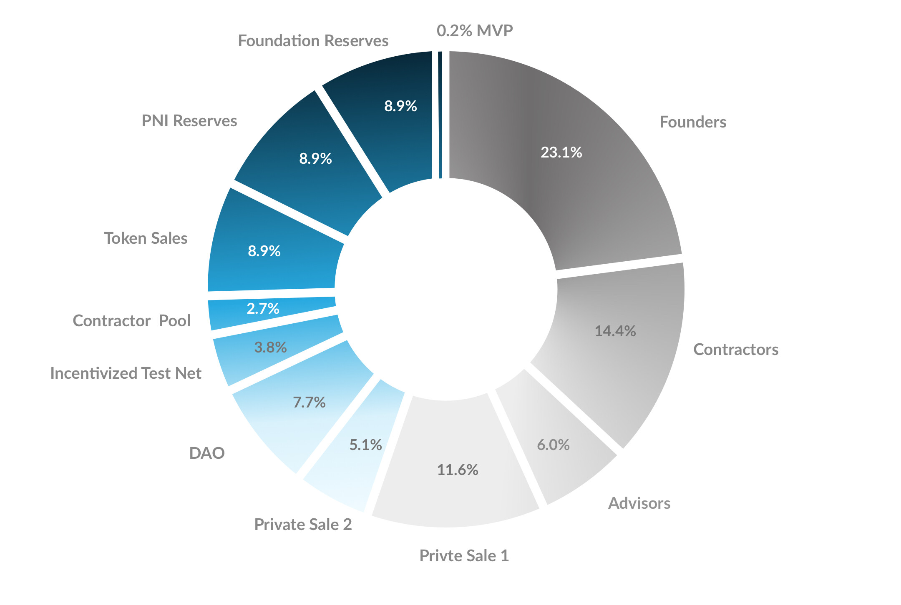
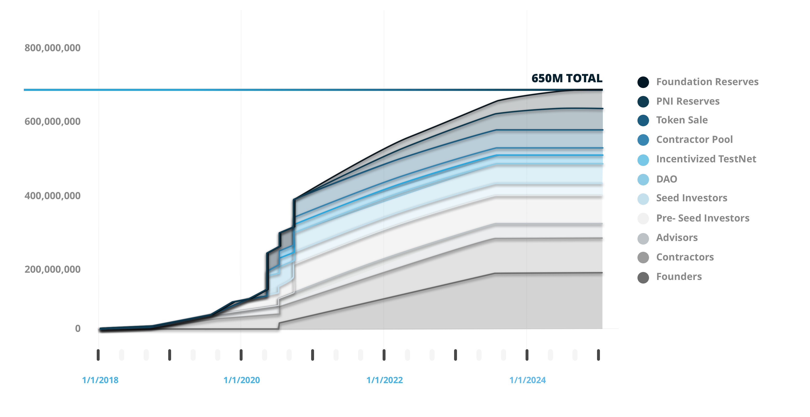
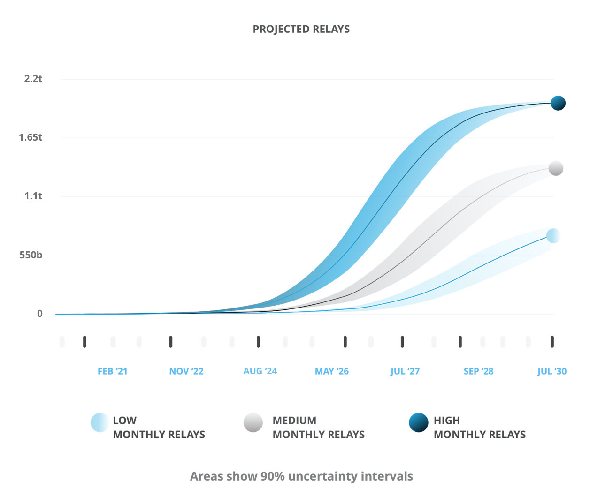
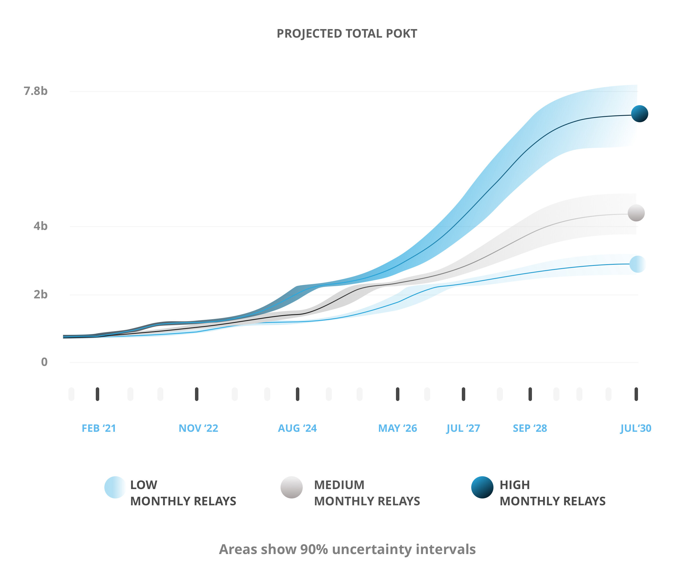

# 💰 Pricing & Economics

## What is POKT?

POKT is the native utility token that powers the economics of the protocol. Pocket Network requires both developers and nodes to stake POKT to participate in the network. Nodes earn POKT for fulfilling API requests for apps on a per request basis.

## How much does it cost to send a relay?

This is determined by the [`BaseRelaysPerPOKT`](../references/protocol-parameters.md#baserelaysperpokt) parameter.

## How much can I earn by running a node?

Pocket is quite a unique blockchain network, because there are two ways for nodes to earn POKT:

1. **Servicing:** processing requests to/from blockchains on behalf of apps
2. **Validating:** confirming blocks, which contain proofs of the above relays done

Each time a block is validated, POKT is minted according to the [`RelaysToTokensMultiplier`](../references/protocol-parameters.md#relaystotokensmultiplier) parameter which means, for every relay processed by a node, this amount of POKT is minted.

This mint is then divided according to the following percentages:

* `1-`[`ProposerAllocation`](../references/protocol-parameters.md#proposerallocation)`-`[`DAOAllocation`](../references/protocol-parameters.md#daoallocation) to all the nodes who did \#1, proportional to the number of relays they did
* [`ProposerAllocation`](../references/protocol-parameters.md#proposerallocation)to the node who validated the block \(\#2\)
* [`DAOAllocation`](../references/protocol-parameters.md#daoallocation)to the DAO

So what does this mean in practice?

Check out [these charts](https://c0d3r.org/NetworkCharts) to view the profitability of nodes over the lifetime of the network.

## What is the minimum staking amount for a node?

The minimum staking amount for nodes is determined by the [`StakeMinimum`](../references/protocol-parameters.md#stakeminimum) parameter. 

However, if a node stake falls below this minimum stake the entire stake will be burned by the protocol. Therefore, as a **best practice**, we **recommend staking an extra 7% to 10% buffer of POKT** above the minimum stake per node. This is to account for any unforeseen slashing events due to node misconfiguration, bad behavior, natural disaster, or potential accidents.

## What determines my odds of being selected to validate a block?

The following formula:

`round down (node stake / avg node stake) = # of tickets in the hat for block producer`

## Is there an advantage to staking all of my POKT on one node?

There is no advantage.

All nodes with the minimum stake have an equal chance of being selected to serve an app during a session. Therefore, to maximize the work you are being selected for, you should split your stake across as many nodes as possible, accounting for the minimum stake plus a buffer as described in [What is the minimum staking amount for a node?](pricing-and-economics.md#what-is-the-minimum-staking-amount-for-a-node)

Similarly, tickets for block production are weighted according to POKT staked in comparison to the average, based on the formula [above](pricing-and-economics.md#what-determines-my-odds-of-being-selected-to-validate-a-block), however it makes no difference to you whether this POKT is all staked on one node or across multiple.

## Why is the number of staked nodes growing faster than the number of staked apps?

While it's true that the supply \(nodes\) of Pocket's two-sided market should respond to demand \(apps\), the important metric is the number of relays, not the number of staked apps.

Nodes are paid proportionally to the relays they process, so if the number of staked apps remains constant while the relays the submit increases, the node supply will grow in response to growing revenue opportunities.

Many apps use the [Pocket Dashboard](https://dashboard.pokt.network) to connect to the network, which stakes and integrates with [PocketJS](https://docs.pokt.network/js) on their behalf. The Dashboard can divide the throughput it has staked for across multiple URLs, which means we don't need to stake a new account for every new app that uses the Dashboard.

## How do I buy POKT?

Visit this [forum post](https://forum.pokt.network/t/secondary-markets-for-pokt/629).

## What is the supply of POKT?

### Genesis & Circulating Supply

The initial supply of POKT is 650M, which is divided according to the following genesis distribution:

The vast majority of these tokens are non-transferable and subject to use restrictions by the holders, starting from mainnet launch.  __

* **Private Sale 1/2:** one-year lockup and use restriction from the date of purchase. Those whose year had already expired pre-mainnet also agreed to an additional lockup according to the following schedule: 50% of tokens unlocked after 6 months, 100% of tokens unlocked after 12 months.  
* **Founder Vesting:** the founders agreed to restart a 3 year vesting schedule upon mainnet launch, with 10% of their allocations immediately vesting upon mainnet launch and subject to a 1-year lockup and use restriction.  __
* **Pocket Network, Inc. \(PNI\)**:  
  * **Token Sale Pool:** fully unlocked at launch and available for direct sale to users of the network.  __
  * **Employee/Contractor Pool:** already-vested tokens subject to a 1-year lockup and use restriction, with varying vesting agreements per contractor on average of 3-4 years.  
  * **PNI Reserves:** subject to 4 years of vesting and non-transferable for five unbonding periods \(105 days total\) following mainnet launch.  __
* **Foundation/DAO:**  
  * **Foundation Reserves:** subject to 4 years of vesting and non-transferable for five unbonding periods \(105 days total\) following mainnet launch.  __
  * **DAO Funds:** fully unlocked at launch and distributed according to DAO grants.  
  * **All other genesis addresses \(e.g. incentivized testnet participants\):** non-transferable for five unbonding periods \(105 days total\) following mainnet launch.

This all results in the following circulating supply schedule:

### Fully Diluted Supply

While the initial total supply of POKT is 650M, Pocket Network uses minting to compensate nodes for performing work on the network. For this reason, POKT is permanently inflationary proportional to usage of the network, but the total supply will be capped through a burning mechanism put in place by the DAO \(more on this below\).

The growth of the POKT supply is directly proportional to the number of relays being processed by nodes. Below we have modeled out 3 different growth scenarios \(Default = conservative growth scenario, Medium = a mid growth scenario, and High = an aggressive growth scenario\).

The Growth Phase of the network is characterized by relatively high rewards and an increase in the POKT supply designed to subsidize the bootstrapping of the network from a node and application perspective. During the Growth Phase of the network, the mint rate is one of the primary drivers that keep the amount of POKT \(and nodes\) in check, decreasing by 10x from .01 to .001 and .0001 when total supply reaches 1B POKT and 2B POKT respectively. In reality, the mint rate decreases over time at the discretion of the DAO. For example, if the DAO believes there is a glut of nodes on the network, it may choose to decrease rewards \(by chainID\) to control the number of nodes on the network. Conversely, the DAO may increase node rewards to encourage network bootstrapping. Decreasing the mint rate will reduce node margins which will impact the number of nodes on the network. Because of this, the mint rate can only be reduced to a certain point.

Once the growth rate of relays begins to decrease because Pocket Network has saturated the broader decentralized infrastructure market, Pocket Network will enter the Maturity Phase. It's at this point that the DAO can choose to institute the Application Burn Rate \(ABR\) which burns developers’ stake at a rate that offsets future inflation - capping the total supply of POKT. The ABR caps the total amount of POKT and ushers in network equilibrium where mint and burn rate is equal. This is reflected in our model by a flattening in the growth in POKT. In all three scenarios, ABR is instituted at the same time but could happen earlier or later as the DAO sees fit.

## 

