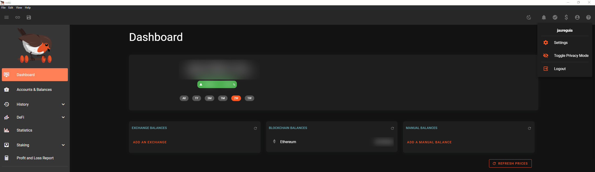
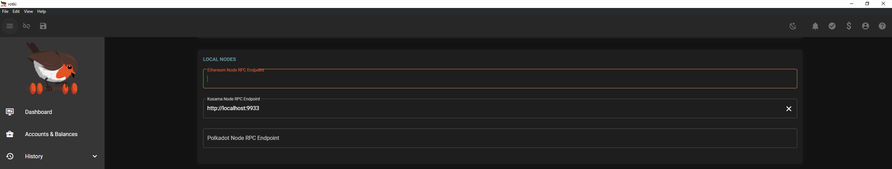
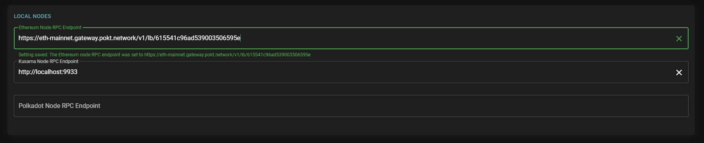

# Rotki

[Rotki](https://bit.ly/RotkiPOKT) is an open-source portfolio tracker and accounting/analytics tool that protects your privacy.

We've sponsored a public Ethereum RPC endpoint for Rotki users in order to add an extra layer of privacy when using the application.

To get started connecting to Pocket's censorship-resistant infrastructure for Ethereum, do the following:

1\. Open and login into your local application.

2\. Toggle to account, then open settings.

3\. Scroll down to the Local Nodes section, then delete the default RPC endpoint.

4\. Copy & Paste this URL into the Ethereum Node RPC Endpoint field:

`https://eth-mainnet.gateway.pokt.network/v1/lb/615541c96ad539003506595e`

Reference the [Rotki User Guide](https://rotki.readthedocs.io/en/latest/usage\_guide.html) for additional support.
