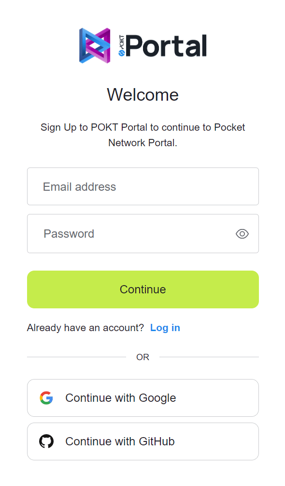
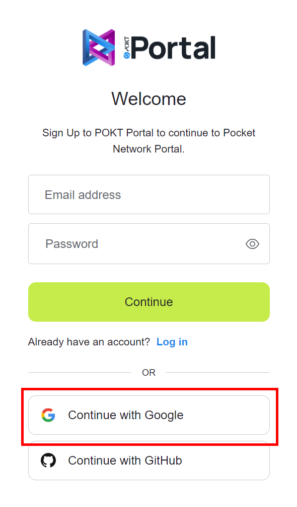
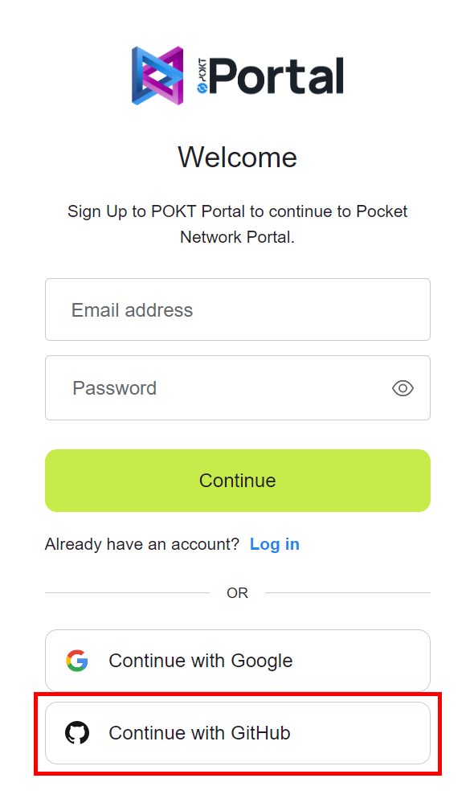
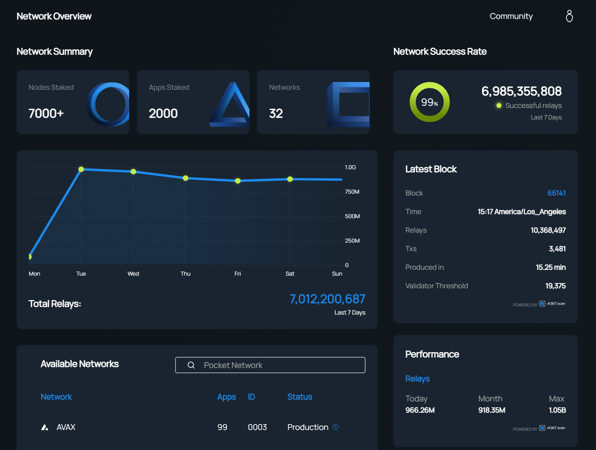

# Get An Endpoint

In order to take advantage of Pocket's network of thousands of decentralized nodes, you need to create a endpoint that you can use in your application.

You can do this using the **Pocket Portal**.

The [Pocket Portal](https://www.portal.pokt.network) is a free, browser-based application that lets you create (or "mint") and manage endpoints that connect to any blockchain supported by Pocket Network. These endpoints can then be used in any application that expects a connection to an RPC provider.

In this way, the Pocket Portal provides similar functionality to more centralized API services, all while retaining the decentralization that Pocket Network is built on.

Through the Pocket Portal, you can get information about your application usage at a glance, along with network usage. uptime metrics and notifications/alerts.

The Portal is free to use up to one million relays per day.


## Create an account

To use the Pocket Portal, you must first create an account.

The Portal accepts three different methods of account creation and authentication: using your email address, your Google Account, or your GitHub account.

Once you have an account with one method, you can't switch to another login method with that account, so make sure you choose the method that works best for you.

### Sign up with email

From the main [Pocket Portal](https://www.portal.pokt.network) page:

1. Click Get started at the bottom of the page. Alternatively, you can click **Log In** and then click **Sign Up**.

2. On the sign up page, enter your email address and a password. When done, click **Continue**.

   

   
   Your password must contain at least 8 characters, and at least 3 of the following character types: lower case letters, upper case letters, numbers, and special characters. If your password does not meet these requirements, the failing criteria will be displayed on the screen.

   
   

3. On the next screen, click **Accept** to authorize the app to allow access to your newly-created account.

   

4. You will then be sent a verification email to the address you entered above. Open this email, and click **Confirm Email Address**.

   

   
   When you click this link, you will be taken to the main Portal homepage. You will know that verification succeeded because you will receive a subsequent email confirming your registration.
      

5. You can now log in. Click the **Log In** button and you will be taken to the Login page. Enter your credentials as previously given and click **Continue**.

Continue below at **Exploring the Portal**.

### Sign up with Google

You can log in to the Portal using your existing Google Account.

1. Click **Get started** at the bottom of the page. Alternatively, you can click **Log In** and then click **Sign Up**.

2. Click **Continue with Google**.

   

3. On the next screen, click **Accept** to authorize the app to allow access to your Google account.

   

4. You will then be logged in and taken to the Network Overview page. You will also receive an email confirming your registration.

Continue below at Exploring the Portal.

### Sign up with GitHub

You can also log in the Portal using your existing GitHub account

1. Click **Get started** at the bottom of the page. Alternatively, you can click **Log In** and then click **Sign Up**.

2. Click **Continue with GitHub**.

   

3. On the next screen, click **Accept** to authorize the app to allow access to your Google account.

   

4. You will then be logged in and taken to the Network Overview page. You will also receive an email confirming your registration.


## Exploring the Portal

Once you've logged in you'll be taken to the Network Overview section.



In this section, you'll see all the important parts of the network: how many relays are being served daily, the overall success rate of the network, and the number of apps, nodes, and POKT staked. A summary of chains being served by the network is also available.

Head over to the "Apps" section and click **Create** to create your app. You'll be able to select one of any of the [supported blockchains](../supported-blockchains.md) to start, but you can add other chains after your Application is created..


Once you've hit "Launch Application", all is done and you can start using your endpoint! You should be greeted by the main application screen, which will show all the metrics, which as soon as you start submitting requests, should start appearing.


The view you see is the main view for your application. Here, you'll see key details:

* On the top left, you'll see and will be able to copy your endpoint URL.
* On the right, first you'll see key information about your Pocket application:
  * The **app status**, which indicates if the app is currently staked or unstaked. The app must be staked in order to be eligible for service.
  * The **amount of POKT** staked, which will be enough to add up to the free tier.
  * The **max amount of relays you can send per day,** which currently is 1M as per the free tier.
* On the bottom right, you'll see important identifying information:
  * The **Gateway ID,** used by the Dashboard to fetch your app's information. It's part of your endpoint URL as well.
  * The **App's public key**, which will let you inspect your application on-chain.
  * The **Secret Key**, which is a security feature you can use to make your Pocket Dashboard endpoint more secure.
* On the left side, you'll see all the metrics available for your app.

## Setting Up Notifications

Turning on notifications is a great way to stay up to date with your app. We respect our users' privacy, and therefore we only send important emails, such as usage notifications. To activate them:

* Click on the "Notifications" button on your app's dashboard, and you'll see the notifications screen.
* Turn on any notifications you're interested in receiving, and then click "Save changes" when you're done.


## Securing your Application

For securing your endpoint, you can go to the "App Security" section of the Portal. This section of the app contains all the security settings you'll have at your disposal for security. We provide whitelisting for both origins and user agents and also let you enable and disable secret key usage.

### Whitelisting User Agents

Mainly useful for mobile apps, whitelisting user agents lets you limit requests to only the ones you've put in the whitelist. An example user agent would be `com.example.bobapp`. This would let Bob's mobile app use the endpoint as his user agent would be whitelisted. If Alice, with user agent `com.example.aliceapp` tried to use the endpoint, she wouldn't be able to, as her requests would be blocked before they're sent to the network.

### Whitelisting Origins

To whitelist origins, just write the URL of the domain you want to allow. All requests from other domains will be blocked. This is a very effective way to only use your app in production, staging, or test environments and to stop malicious users from stealing your endpoint and using it in their project.

For origins, we support wildcard domains as well as normal domains. An example URL would be `https://portal.pokt.network`.

### Using your Secret Key

Every application has a secret key associated with it, which can be enabled so that every request has to send it using [HTTP Basic Authentication](https://developer.mozilla.org/en-US/docs/Web/HTTP/Authentication) to be accepted. An example cURL request with the secret key enabled would be:



```
curl --user :YOUR-SECRET-KEY \\
...
https://<NETWORK>.gateway.pokt.network/v1/YOUR-GATEWAY-ID
```



```
curl --user :YOUR-SECRET-KEY ^
...
https://<NETWORK>.gateway.pokt.network/v1/YOUR-GATEWAY-ID
```



This is a truncated example of a call that does not actually send a request. See below for a more detailed example.

## Testing your Endpoint

Once you've set up your endpoint as per your liking, you can test it however you'd like. In the main application view of the dashboard, you'll be able to see and copy your endpoint to the clipboard. The way endpoints are used in terms of content sent in the body will depend on the chain.

For EVM-based chains (Ethereum, BSC, and others), which see the majority of traffic in Pocket Network, you can refer to the official [JSON-RPC](https://ethereum.org/en/developers/docs/apis/json-rpc/#json-rpc-methods) specification. Below we have a few examples of requests for Pocket compatible chains.

### Ethereum, BSC and EVM-based chains



```
curl -X POST \\
-H "Content-Type: application/json" \\
--data '{"jsonrpc": "2.0", "id": 1, "method": "eth_blockNumber", "params": []}' \\
"https://<NETWORK>.gateway.pokt.network/v1/<YOUR-GATEWAY-ID>"
```



```
curl -X POST ^
-H "Content-Type: application/json" ^
--data "{\"jsonrpc\": \"2.0\", \"id\": 1, \"method\": \"eth_blockNumber\", \"params\": []}" ^
"https://<NETWORK>.gateway.pokt.network/v1/<YOUR-GATEWAY-ID>"
```



### How Endpoints are Constructed

All endpoints have a similar structure, as they all have:

* The network prefix; see the RelayChainIDs [here](../supported-blockchains.md)
* The main URL (`gateway.pokt.network/v1/`)
* If it's a load-balanced endpoint, it will also have the LB prefix (`/lb/`)
* The Gateway ID.


## Use EthersJS

You can use Pocket as your node provider with this complete and compact Ethereum library

First, you need to get an endpoint from the [Pocket Portal](https://www.portal.pokt.network).

Then you need to get the Gateway ID


and insert it like so

```
ethers.providers.PocketProvider('homestead', process.env.GatewayID)
```


## Endpoint FAQ

### I just want an endpoint, where can I get one?

The [Pocket Portal](https://www.portal.pokt.network/) stakes on your behalf and generates the endpoint you need.

### How does the Pocket Portal work?

The Pocket Portal is tasked with connecting to the Pocket Network through PocketJS on your behalf—essentially doing the integration work for you. The only thing that changes here is the layer of abstraction between you, the developer, and the nodes. You are still ultimately being served by a decentralized network of thousands of nodes.

### What does it mean for an endpoint to be "load-balanced"?

This means that there's more than one Application behind your endpoint, where an Application is defined as the account staking into the network for the purpose of submitting relay requests. For each request you need to submit, one of these app stakes gets chosen pseudorandomly and is used to make the request to the network. We have several algorithms in place to cherry-pick the best-performing app stakes for each session, based on the nodes they've been matched with, and ensure the best QoS.

### What can I do if I exceed my allotted requests?

If you ever exceed the amount of daily (or per-session) amount of requests, contact the sales team or jump into our Discord to let us know; we'll work something out!

